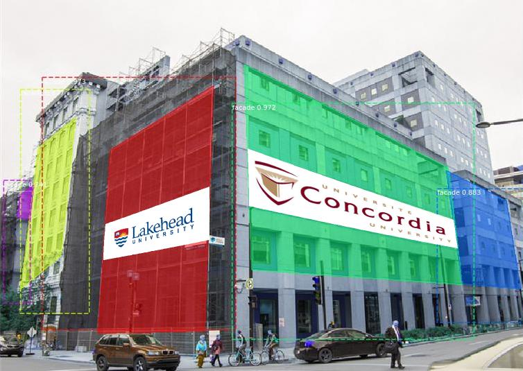
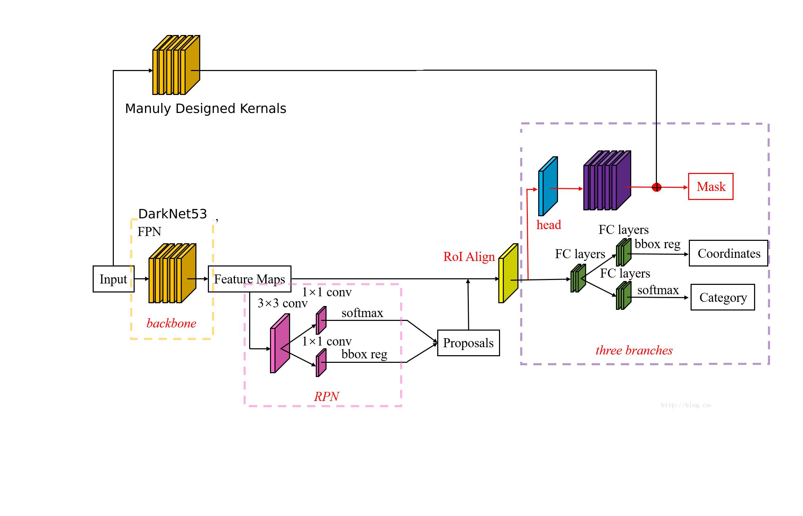
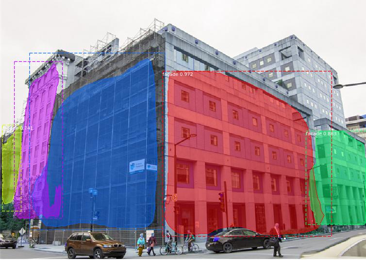
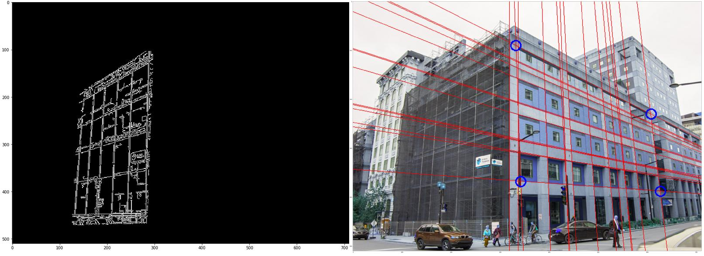
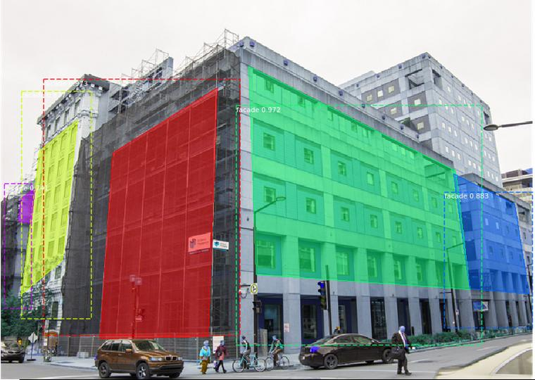

# Facade-Segnet-AR
## Important

We implement a novel object proposals method specific to building-facades. We fuse low level image cues such as texture and ORB into modified Mask R-CNN to correct facades.  Features are combined to generate a few facade candidates in urban environ-ments fast.  Then we Augmented Reality the ad.

## Reference

Paper:  
[Facade Proposals for Urban Augmented Reality](https://hal.inria.fr/hal-01562392/document)

## Requirements

Python 3.7, Tensorflow 1.3, OpenCV 4.0, labelme and other common packages listed in Requirements.txt.

## MS COCO format Dataset Requirements:
To train or test on MS COCO format Dataset, you'll also need:

1. pycocotools (installation instructions below)
2. Download the ZUBuDataset and the etrims Dataset. Then label and save them as COCO format, more details in the labelme https://github.com/wkentaro/labelme.

## DarkNet53Mask Structure.
We select Darknet53 from YOLO as the backbone, ResNet101 is excess performance.

## Facades Find

We totally labelled 128 pictures, after 10 epochs training, we get a good results. without fusing manually designed features

## Texture & ORB Augmented Visualization

ORB & Texture features with Hough Transform.

## Final Facades Detection

After Features Fusion, get the transformed regular quadrilateral.

